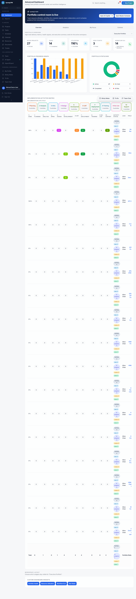
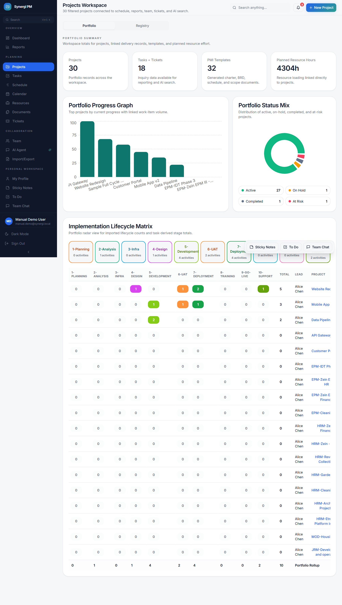
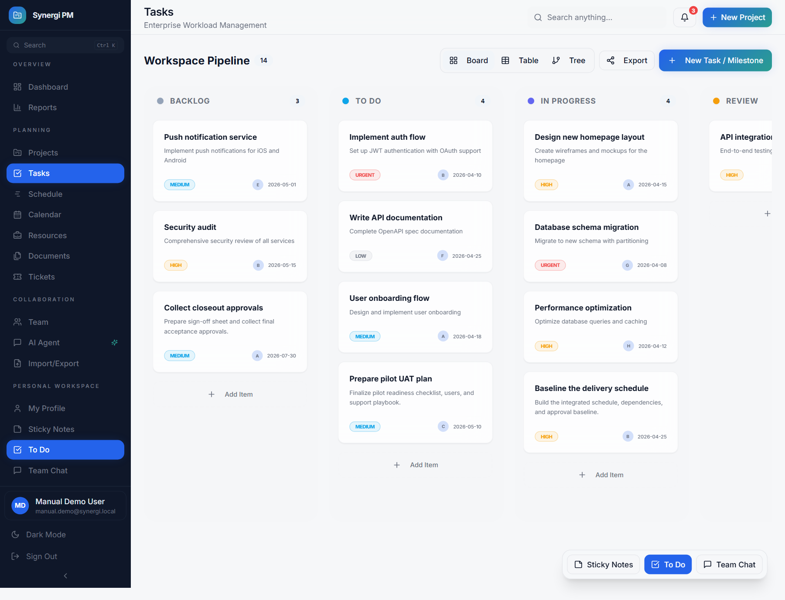
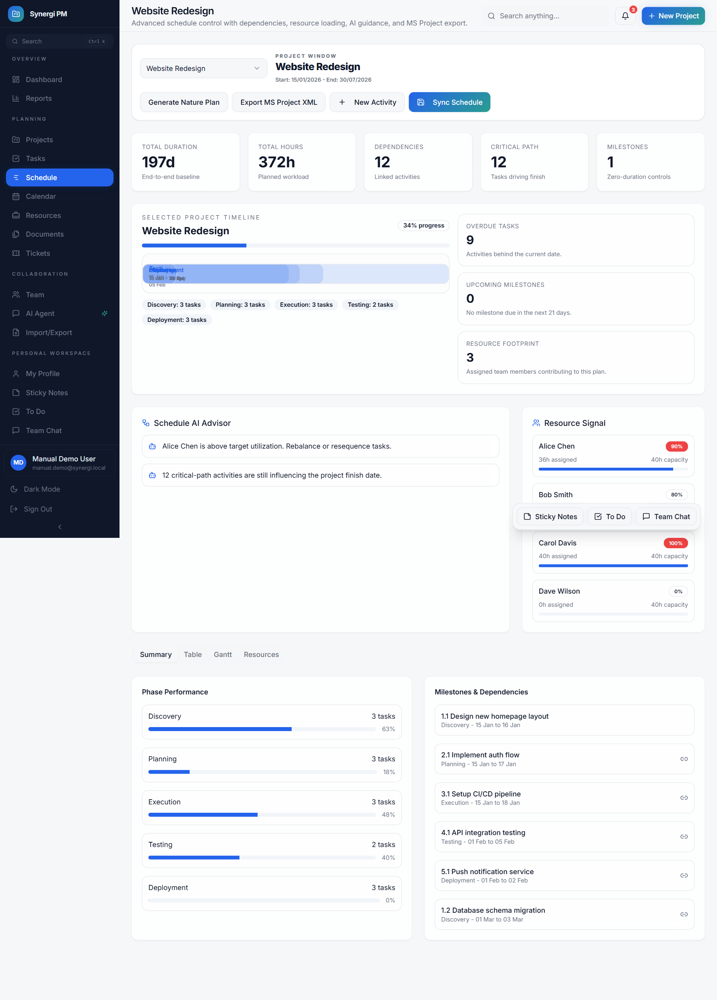
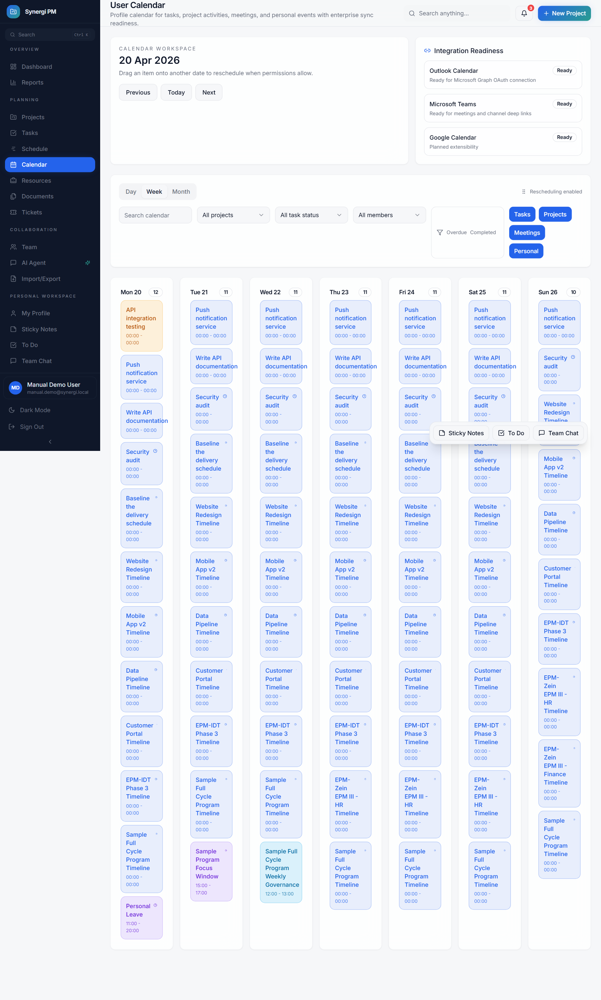
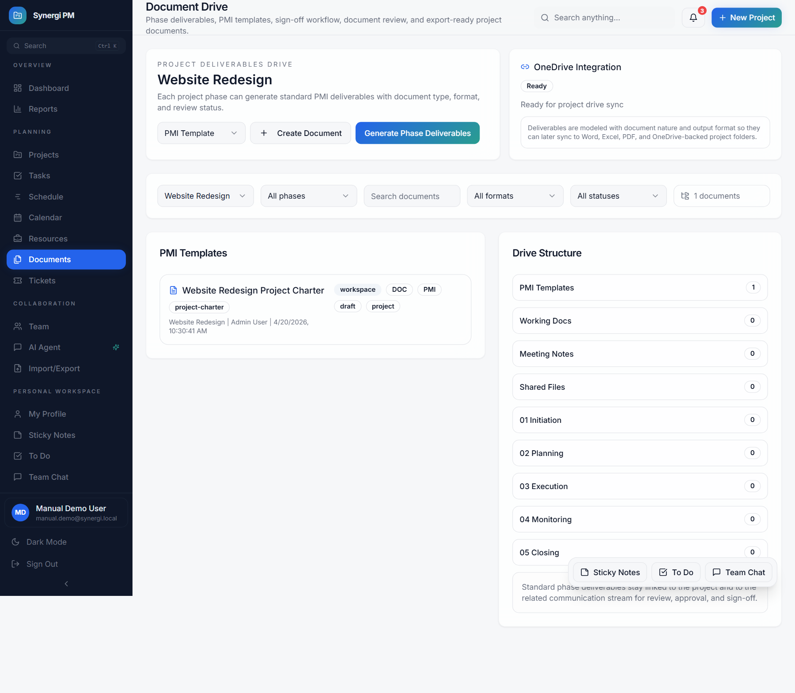
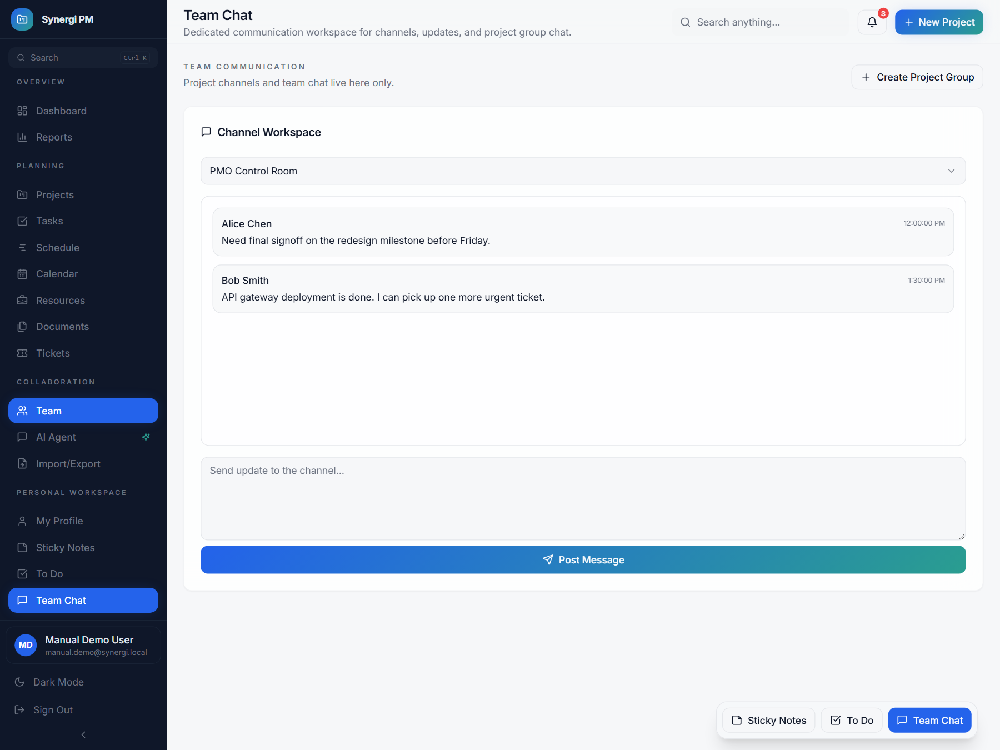
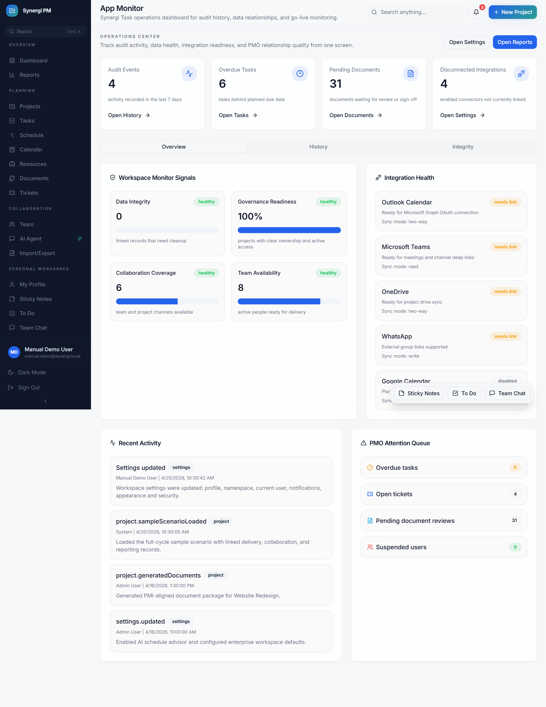
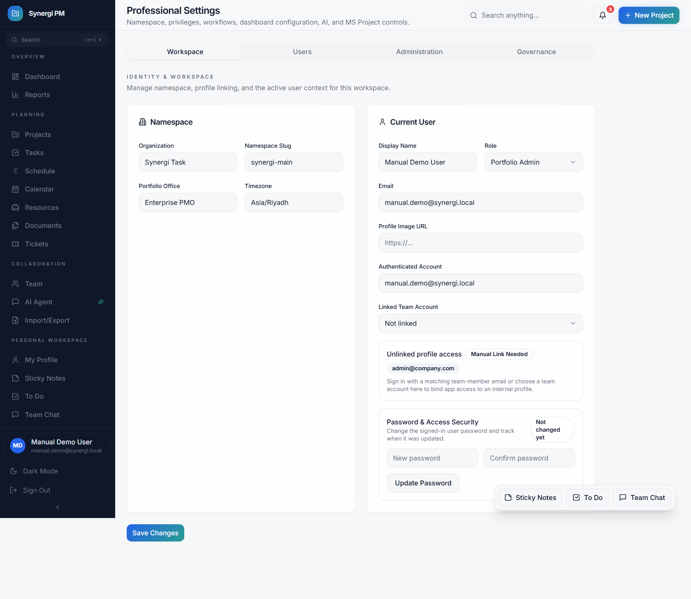

# Synergi PM Application User Manual

This manual explains how to use the Synergi PM workspace as an AI-powered project management platform for portfolio planning, delivery tracking, documentation, collaboration, and administration.

Screenshots in this guide were captured from a demo workspace on April 20, 2026.

## 1. What This Application Does

Synergi PM combines:

- project portfolio management
- task and ticket tracking
- schedule and dependency planning
- team collaboration and chat
- PMI-style document generation
- reporting and dashboards
- app monitoring, audit history, and administration

Main workspace areas:

- `Dashboard`
- `Projects`
- `Tasks`
- `Schedule`
- `Calendar`
- `Documents`
- `Team Chat`
- `Reports`
- `App Monitor`
- `Settings`

## 2. Sign In

Users can access the application through:

- email and password
- Google authentication

After sign-in, the app opens the protected workspace and loads the user profile, linked team profile, and assigned permissions.

## 3. Navigation Overview

The sidebar is organized into:

- `Overview`
- `Planning`
- `Collaboration`
- `Personal Workspace`
- `Administration`

The bottom quick-action dock gives fast access to:

- `Sticky Notes`
- `To Do`
- `Team Chat`

## 4. Dashboard

The dashboard is the main portfolio control center.

Use the dashboard to:

- review portfolio KPIs
- check project health and status mix
- open the lifecycle activity matrix
- click activity counts to open filtered task lists
- switch custom dashboards
- review workload and execution trends

Typical actions:

1. Open `Dashboard`.
2. Review portfolio cards and chart widgets.
3. Click lifecycle cells or status chips to drill into task activities.
4. Use the dashboard selector to switch between saved dashboards.

## 5. Projects Workspace

The Projects page is the main PMO workspace for creating and managing projects.

Use it to:

- create a new project
- edit project details later
- define team structure, stakeholders, risks, and resources
- generate PMI or SAP document templates
- review linked tasks and tickets
- open project-related communication and documents

Typical project creation flow:

1. Click `New Project`.
2. Enter the project name, description, dates, status, and priority.
3. Add team members, roles, risks, stakeholders, and tags.
4. Choose PMI or SAP template generation if required.
5. Save the project.
6. Open related tasks, documents, schedule, and chat from the project area.

## 6. Tasks Workspace

Tasks are used for project delivery, team activity tracking, and daily work execution.

Use Tasks to:

- create tasks and subtasks
- assign owners
- update status and priority
- log timesheets and daily activities
- connect tasks to projects
- open project-filtered task views from dashboards and project cards

Recommended task workflow:

1. Open `Tasks`.
2. Create a task or filter tasks by project.
3. Assign the task to a team member.
4. Update status as work progresses.
5. Add timesheet entries for daily activity logging.

## 7. Schedule Page

The Schedule page acts as the planning board for project timelines and dependencies.

Use it to:

- add tasks directly in table view
- edit task dates inline
- manage dependencies
- maintain WBS structure
- review progress summary and timeline bars
- sync schedule items back to the main task list

Recommended scheduling flow:

1. Open `Schedule`.
2. Choose the project.
3. Add or edit tasks in table view.
4. Set start date, end date, duration, and predecessors.
5. Click `Sync Schedule` to update the project plan.

## 8. Calendar Page

The calendar is used for user and project activity planning.

Use the calendar to:

- view tasks by day, week, or month
- review project activities
- review meetings and personal events
- filter by member, project, and status
- reschedule items where permitted

Recommended use:

1. Open `Calendar`.
2. Select the desired view.
3. Apply filters for project, member, or status.
4. Open an item to see full details.

## 9. Documents Drive

Documents are managed from the built-in project document drive.

Use Documents to:

- view generated PMI or SAP documents
- review project attachments
- update document content
- manage review status
- track document metadata and versions

Typical document flow:

1. Generate project documents from the project page.
2. Open `Documents`.
3. Filter by project, phase, or review status.
4. Open the document for review.
5. Edit and save changes if permissions allow.
6. Download the file in the required output format.

## 10. Team Chat

Team Chat is the internal communication area for teams and project groups.

Use Team Chat to:

- create project group channels
- post collaboration messages
- keep team discussions inside the workspace
- link project communication with delivery work

Recommended use:

1. Open `Team Chat`.
2. Select an existing channel or create a project group.
3. Post updates, questions, and team notices.
4. Use project-linked groups for delivery-specific coordination.

## 11. App Monitor and Audit History

The App Monitor is the operational health center for the workspace.

Use it to:

- review audit logs
- check app history
- find overdue work
- identify disconnected integrations
- review relationship issues such as orphaned tasks or tickets
- monitor PMO readiness and governance quality

Tabs available:

- `Overview`
- `History`
- `Integrity`

Recommended use:

1. Open `App Monitor`.
2. Review alerts and workspace health cards.
3. Open `History` to search recent actions.
4. Open `Integrity` to review data relationship issues.

## 12. Settings and Administration

Settings manages workspace identity, access, metadata, dashboards, workflows, and integrations.

Use Settings to manage:

- workspace namespace and profile
- user access and roles
- metadata and configurable dropdowns
- custom fields for forms
- integrations
- dashboard templates
- audit visibility
- governance and automation settings

Admin responsibilities:

1. Open `Settings`.
2. Review `Workspace`, `Users`, `Administration`, and `Governance`.
3. Update metadata, users, dashboards, and workflow settings as needed.

## 13. Recommended End-to-End Workflow

For a normal project delivery cycle:

1. Create the project from `Projects`.
2. Define resources, team structure, stakeholders, and risks.
3. Generate PMI or SAP documents.
4. Build the plan in `Schedule`.
5. Track execution in `Tasks`.
6. Coordinate through `Team Chat`.
7. Review progress in `Dashboard`.
8. Monitor issues and data quality in `App Monitor`.
9. Use `Reports` for status reporting and stakeholder communication.

## 14. Best Practices

- Keep each task linked to a valid project.
- Use the Schedule page for dependency-driven planning.
- Use Team Chat for project-specific decisions and updates.
- Generate documents from project data instead of writing them manually from scratch.
- Review App Monitor regularly to catch data integrity and governance issues early.
- Use configurable fields and metadata from Settings instead of hardcoding categories in daily work.

## 15. File Locations

This guide:

- [application-user-manual.md](C:/projects/synergi-task/docs/application-user-manual.md)

Screenshot assets:

- [dashboard-overview.png](C:/projects/synergi-task/docs/screenshots/dashboard-overview.png)
- [projects-portfolio.png](C:/projects/synergi-task/docs/screenshots/projects-portfolio.png)
- [tasks-workspace.png](C:/projects/synergi-task/docs/screenshots/tasks-workspace.png)
- [schedule-planner.png](C:/projects/synergi-task/docs/screenshots/schedule-planner.png)
- [calendar-planner.png](C:/projects/synergi-task/docs/screenshots/calendar-planner.png)
- [documents-drive.png](C:/projects/synergi-task/docs/screenshots/documents-drive.png)
- [team-chat.png](C:/projects/synergi-task/docs/screenshots/team-chat.png)
- [app-monitor.png](C:/projects/synergi-task/docs/screenshots/app-monitor.png)
- [settings-admin.png](C:/projects/synergi-task/docs/screenshots/settings-admin.png)
